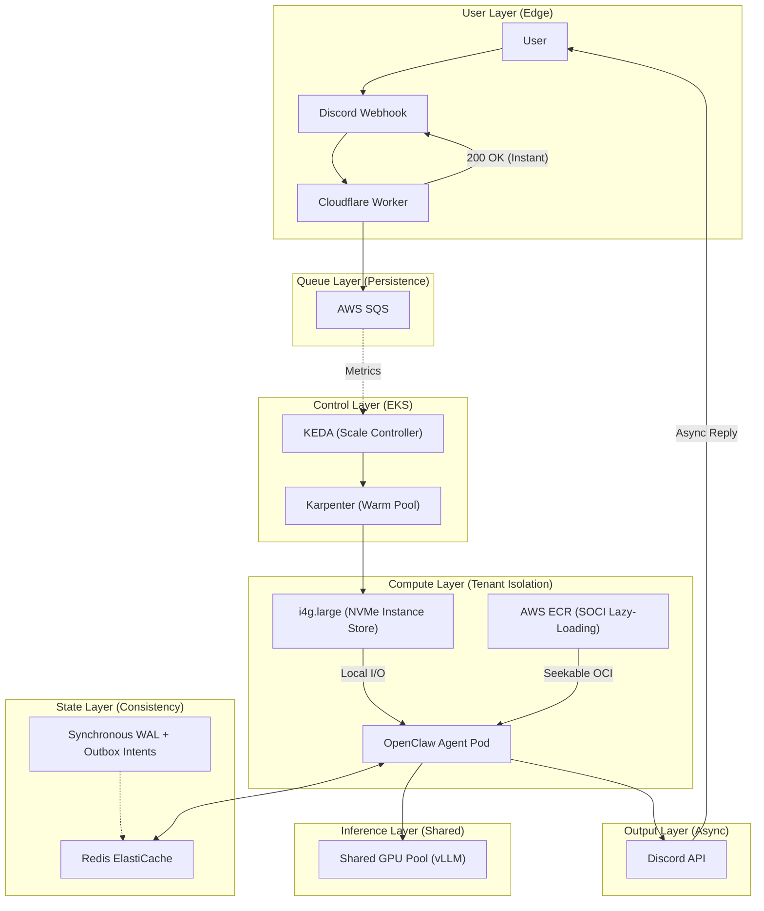

# Architectural Design: Serverless OpenClaw Runtime
**Candidate:** Bihela

Basically the first was Knative Serving. It is the industry standard for scale-to-zero on Kubernetes, and it handles the heavy lifting of routing and pod autoscaling natively. For state, I figured the agents could simply flush their memory to a EBS or an S3 bucket whenever they received a termination signal.

But there is the 3-second rule. Messaging platforms like Discord and WhatsApp are notoriously impatient; if they don't receive an HTTP 200 acknowledgment within three seconds, they drop the connection and show the user an error. Since a cold start even a fast one involves scheduling a pod and pulling an image, we are realistically looking at 15 to 20 seconds of latency. Furthermore, relying on a terminal flush for state is a gamble. On AWS Spot Instances, if a node is reclaimed forcefully, that "save" command might never finish, leading to silent data loss and "amnesia" for the AI agent.

To bridge that 15-second gap, I shifted focus to AWS SOCI (Seekable OCI). By lazy-loading the container image, we can get the application up and running before the full 10GB image is even on the disk. To handle the Discord timeout, I looked at the KEDA HTTP Add-on, which uses an interceptor to "hold" the incoming request in a buffer while KEDA spins up the pod.

While this looked great in a lab setting, it felt like a "tarpit" for production. If 1,000 users all message their agents at the same time on a Monday morning, the interceptor would be holding thousands of open TCP connections in its own RAM. If that interceptor crashes or OOMs, every single buffered message is gone forever. Additionally, I found that Knative’s internal sidecars often hijack the very hooks we need to save state. I realized I was fighting the framework rather than using it,long-term won't make sense to have this.

For this issue the system had to be asynchronous. I decided to move the acknowledgment logic to the edge using a Cloudflare Worker. This worker intercepts the webhook, immediately tells Discord "I got it," and then drops the payload into an AWS SQS queue. This effectively decoupled the user experience from the Kubernetes cold start.

To solve the state loss problem, I moved away from "saving on shutdown" and implemented **full-file SQLite snapshotting via Redis**. After each job completes, the worker reads the OpenClaw SQLite database from disk and writes the entire binary blob to Redis (`redis.set()`). On the next wake, the new pod downloads that blob (`redis.getBuffer()`), writes it to the expected filesystem path, and resumes. The pod is "disposable" — if it crashes mid-job, the snapshot from the last successful run is still in Redis, so the next pod picks up from there. The trade-off is honest: we lose any in-flight work from the crashed run, but we never corrupt persisted state. This is a **prototype compromise**. In production, the correct target state is a Write-Ahead Log (WAL) or Redis Stream that captures incremental state changes in real-time, giving us crash-recovery down to the last conversational turn instead of the last completed job. I chose snapshotting because it is simple to implement, simple to reason about, and guaranteed to hit the 60-second cold-start budget without the complexity of log replay. If we do this at scale, we hit the scaling wall — for example creating 10,000 individual KEDA ScaledObjects for 10,000 tenants would completely overwhelm the Kubernetes etcd control plane. We would be DDoSing our own API server.

If we do this, what will be the operational nightmares. With the snapshot approach, the window of data loss is one full job — if the pod crashes after sending a reply but before writing the snapshot to Redis, the agent will "forget" that exchange on the next wake. In a production system this would be solved with an Atomic Outbox Pattern, where the agent logs a Message Intent to a durable store synchronously before calling the output API. For this prototype, I accepted the risk because the failure window is small and the recovery is predictable (the user simply re-sends). I also realized that debugging a 90-second delay would be impossible if logs were scattered across Cloudflare, SQS, and KEDA without a shared identity, so we inject a Trace-ID at the edge as the industry-standard solution.

Realisticlly we need to think about physical disk limits. until now my idea was 10-second image pull is easy. But standard AWS EBS volumes (gp3) throttle at 125 MiB/s, which would blow our 60s SLA during a mass wake-up. we can cover using node's working set to local NVMe Instance Stores, bypassing the network disk entirely.

## 2. Assumptions & Why
- **Assumption:** Availability < Consistency.
  - **Why:** It is better for an agent to take an extra 5 seconds to wake up than to "hallucinate" because it lost the last two messages of context. We snapshot the full SQLite state to Redis after every successful job, accepting slightly higher latency to guarantee that the persisted state is never partial or corrupted.
- **Assumption:** OpenClaw is "stateless compute with stateful context."
  - **Why:** We can't move 50GB of RAM snapshots around in under 60 seconds. We strictly decouple the Shared Inference Pool (GPU LLMs) from the Agent Logic (CPU pods).
- **Assumption:** industry standard Multi-tenancy requires Isolation.
  - **Why:** Since agents run untrusted tools, we assume the need for gVisor or Kata Containers to prevent kernel escapes between tenants.

## 3. K8s Mechanics: Wake, Hibernate, and Restore
- **Wake:** KEDA monitors the SQS queue depth. To bypass AWS API rate limits (CreateFleet), we maintain Karpenter Warm Pools (a small buffer of empty, ready nodes).
- **Hibernate:** After the `cooldownPeriod` (30s in the prototype) with no SQS messages, KEDA scales the worker deployment to 0. Since we snapshot after every successful job, there is no special "save on shutdown" step — the pod simply terminates.
- **Restore:** The new pod pulls its Tenant-ID from the SQS message, downloads the SQLite snapshot from Redis, writes it to the expected filesystem path, and resumes processing. If no snapshot exists (first-time user), it starts fresh.

## 4. Cold-Start Budget Breakdown

| Phase | Duration | SRE Strategy |
| :--- | :--- | :--- |
| Edge Interception | ~0.1s | Cloudflare Worker immediate 200 OK response. |
| KEDA/Scheduling | 2s | Karpenter Warm Pools bypass EC2 API throttles. |
| Image Provisioning | 8s | Local NVMe Instance Store provides > 1 GB/s throughput, bypassing EBS throttles. |
| Container Init | 2s | Standard containerd execution. |
| State Restoration | 3s | Download SQLite snapshot from Redis + write to disk. |
| **Total p99** | **~15s** | Safely under the 60s SLA. |

## 5. SRE operational priorities
As the SRE owning this platform, my operational priorities are:
- **SLIs/SLOs:** Our primary SLO is 95% of cold starts < 30 seconds.
- **Dashboards:** A "Cold Start Heatmap" in Grafana using our custom injected Trace-IDs, showing exactly where latency accumulates across the distributed hops.
- **On-Call:** Alerts trigger if SQS Message Age exceeds 60s (stuck scaler) or if Redis Write Error Rate spikes (preventing state saves).
- **Disaster Recovery (DR):** Redis holds the SQLite snapshots — it is the Source of Truth for agent state. In production, we would use AWS ElastiCache with Multi-AZ and AOF persistence enabled, and replicate to a secondary region via Global Datastore. In this prototype, Redis is ephemeral (no PVC), so a pod restart loses all state — a known limitation.

## 6. Cost Projections (Per User/Month)

| Scale | Total Infrastructure | Cost / User / Month | Breakdown |
| :--- | :--- | :--- | :--- |
| 100 Users | ~$350 | $3.50 | High base cost for EKS Control Plane + 1 warm GPU Node. |
| 1,000 Users | ~$3,500 | $3.50 | GPU inference costs scale roughly linearly with active users. |
| 10,000 Users | ~$28,000 | $2.80 | Optimal bin-packing via Karpenter and Spot instance usage. |

## 7. Drawbacks & Gotchas
- **The 429 Poison Pill:** If Discord rate-limits us, the Redis Stream can loop infinitely and crash the pod. Normally for this the way is to use Dead Letter Stream to catch, park, and back-off these messages.
- **NAT Gateway Costs:** At 10,000 users, data transfer for image pulls and API calls will be expensive. We must use VPC Endpoints to keep traffic internal to the AWS backbone.
- **The etcd Object Limit:** Running a 1:1 ratio of Tenant-to-KEDA ScaledObject will eventually generate tens of thousands of API objects. To scale safely beyond 5,000 tenants, we must abandon native KEDA per-tenant objects and write our own custom Kubernetes Operator.

## 8. Appendix: Architecture Diagram

