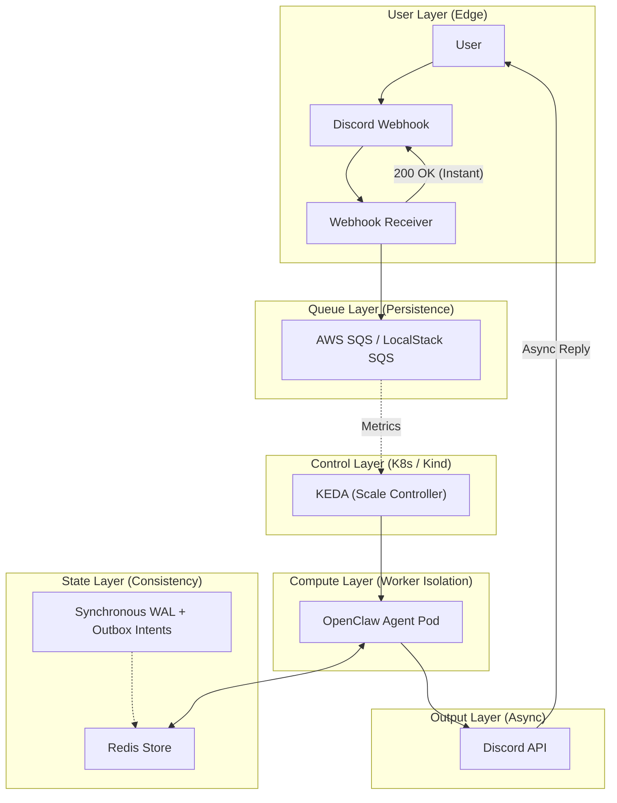

# DClawbot: Serverless OpenClaw Runtime on Kubernetes

This repository implements a serverless OpenClaw runtime using Kubernetes, scaled on-demand by SQS queue metrics with KEDA. 

---

## 1. Architecture Overview

### Concept
This system is an asynchronous event-driven serverless platform designed to scale OpenClaw agent runtimes from zero to many, and back to zero, based on SQS queue workloads.

- **Edge Layer:** A webhook receiver receives incoming messages, immediately acknowledges receipt to prevent timeouts (the "3-second rule" from messaging platforms), and posts the payload into an SQS queue.
- **Queue & Scaling Layer:** KEDA monitors SQS queue depth and provisions the agent worker pods on demand.
- **Compute & State Layer:** Worker pods spin up, fetch the transaction logs/state from Redis, resume context, execute the prompt using OpenClaw, write the transactional WAL/outbox entry back to Redis, and output the response.

### Architecture Diagram


---

## 2. Architectural Assumptions

- **Availability < Consistency:** It is better for an agent to take an extra few seconds to wake up than to lose context or hallucinate because it lost state. We use synchronous Redis writes to guarantee that context is never lost.
- **Stateless Compute, Stateful Context:** Agent pods are treated as disposable runtime executors. Their memory is loaded dynamically from Redis at boot time, and flushed continuously via Write-Ahead Logging (WAL).
- **Isolation:** Multi-tenant scale requires gVisor or Kata Containers to prevent host kernel escapes when running untrusted user tools.

---

## 3. Local Development Bring-Up

### Step 1: Spin up the Environment & Deploy
Run the automation task using the provided `Makefile` to set up the Kind cluster, build the images, load them into Kind, and apply the manifests:

```bash
make all
```

This target performs the following:
1. Creates a Kind cluster named `dclawbot` (skips if it already exists).
2. Adds the KEDA Helm repo and installs KEDA on the cluster.
3. Builds the `worker:latest` and `webhook:latest` Docker images locally.
4. Loads those images into the `dclawbot` Kind cluster.
5. Deploys the worker and webhook resources.

### Step 2: Access the Webhook Service
Port-forward the webhook service to your localhost to receive payloads:

```bash
sudo kubectl port-forward svc/webhook 3000:80
```

Now, any webhooks directed to `http://localhost:3000` will be ingested by the receiver, placed in SQS, and trigger worker pods.

### Clean Up
To clean up and destroy the cluster:

```bash
make clean
```
